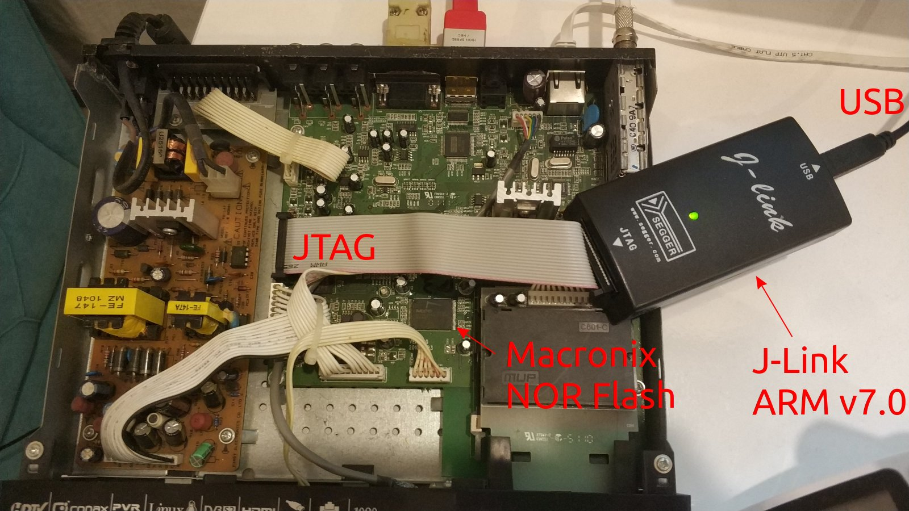
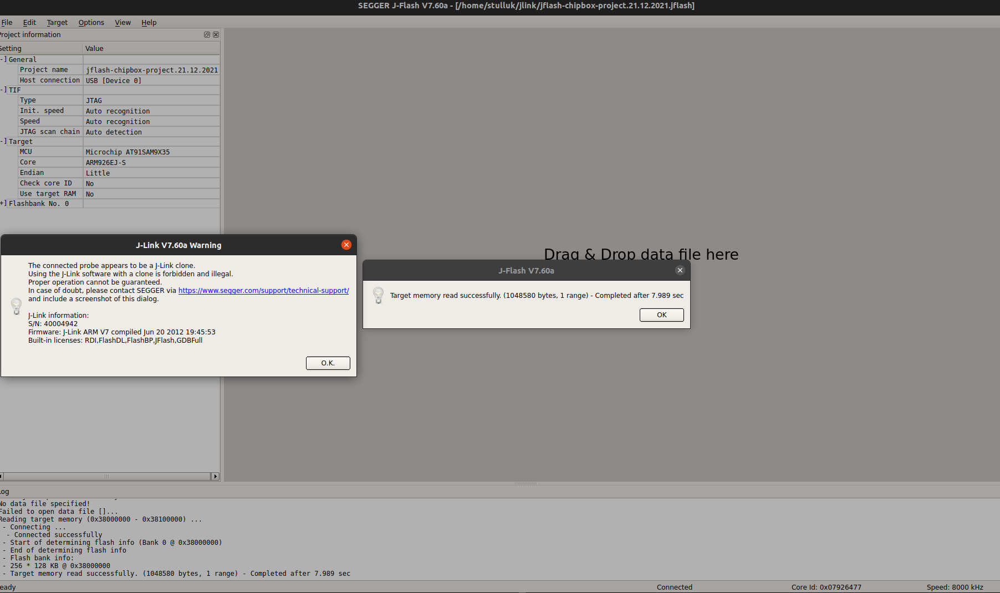
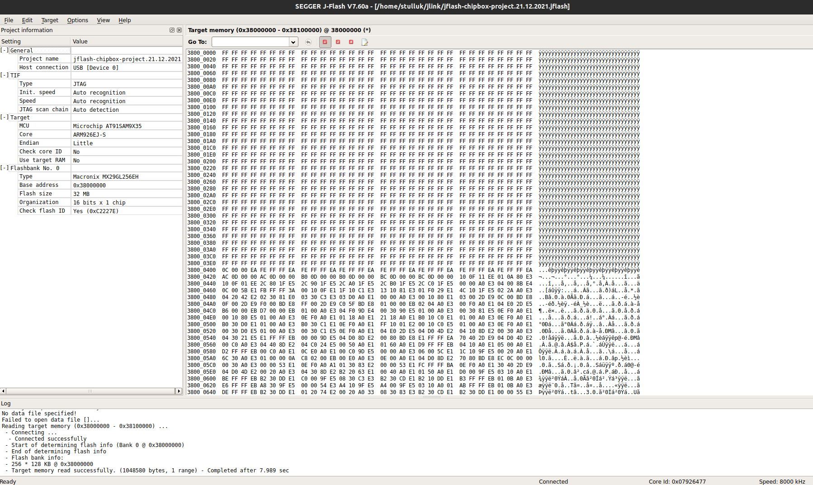

# chipbox-jtag

JTAG related things about Chipbox

See [What is the Chipbox?](https://gitlab.com/stulluk/chipbox-pars)

## About this repository

This repository is an overloaded mirror in both github and gitlab

I did this trick via:

1. Create both repositories under both github and gitlab with exactly same name
2. Then after cloning from one repo, I did below:
```
git remote set-url –add origin https://github.com/user/repo.git
```
3. When I push, it goes to both repos

## About Chipbox NOR Flash 

Chipbox has a Macronix mx29gl256eht2I-90q CFI compliant NOR Flash (32megabytes)

The chipset (CelestialSemi CSM1203) supports programming that flash via JTAG interface.

## Programming Chipbox NOR Flash via JTAG

This is done as shown in the following photo:



### Bad news and good news

After many years, I found this J-Link JTAG programmer from my warehouse and decided to give a try.

Good news-1: It was working
Good news-2: Segger had JFlash tools for linux ( As a deb package)

Bad news-1: My J-Link turned out to be a clone, and JFlashExe was allways complaining about it.
Bad news-2: Probably because of BN-1 above, I could newer be able to read NOR Flash completely (Neighter in Linux nor in Windows ).

But I was consistently be able to read partially ( about 4Megabytes was possible). 

Then I realized that, I could run JFlash via commandline under linux, so I decided to write a bash script for it:

[chipbox-flash-dump](chipbox-flash-dump.sh)

Note the trick: The cmdline arguments to JFlash is ordered !! This caused me to loose at least 2 days. When you write ```--readrange``` after ```--saveas``` it just doesn't save the file !!!

As you will see, this script uses a file called [jflash-chipbox-project.21.12.2021.jflash](jflash-chipbox-project.21.12.2021.jflash)

Enter BN-3:

Bad news-3: Back in 2011, I have been able to read / write NOR Flash consistently via my Windows PC's in the lab. And I remember that I had a jflash project file for it. But since I lost all these data, I had to write my own jflash project.

It wasn't too complicated to find out how to setup this project file. But there were two big questions:
1. Since CSM1203 was not in the supported chips, I had to select one ARM926EJ-S based ones, but which one?
2. Selecting right external flash was easy ( I had Chipbox at hand, and opened top cover, read the Flash IC part no). But what was the offset value ? By reading terrible howto.txt files from my archieves and via trial and error, I found that the offset was 0x38000000

So in overall, my Jflash UI was looking like this:





Some notes here:

- J-Link allways pops up this warning that jtag is a clone ! As I said above, I suspect that this is the reason why I can't read all of the Flash at once. I tried to read all sectors one by one, and it just can read without any issues.
- Uboot starts at 0x38000400 !!!

## Comparing binaries 

I know nobody will read here, but let me save if anyone get benefit from it:

```
colordiff -y <(xxd All32m.bin) <(xxd selected.bin) | less -R
```

## Chipbox partition layout

Now it gets complicated... Since the built-in storage of Chipbox was a CFI compliant NOR Flash, linux treats this as a MTD device. 

MTD device is neighter block nor character device. Linux kernel has a module called mtdblock, so it somehow translates those MTD devices like block devices in the userspace.

Anyway, during Chipbox kernel booting, we see some interesting messages:

```
...
RAMDISK driver initialized: 1 RAM disks of 16384K size 1024 blocksize
loop: loaded (max 8 devices)
ORION eth0: 0x41400000 IRQ 24 MAC:02:03:04:61:72:a8
Not SST flash.<5>physmap flash device: 2000000 at 38000000
phys_mapped_flash: Found 1 x16 devices at 0x0 in 16-bit bank
 Amd/Fujitsu Extended Query Table at 0x0040
phys_mapped_flash: CFI does not contain boot bank location. Assuming top.
number of CFI chips: 1
cfi_cmdset_0002: Disabling erase-suspend-program due to code brokenness.
10 cmdlinepart partitions found on MTD device phys_mapped_flash
Creating 10 MTD partitions on "phys_mapped_flash":
0x00000000-0x000a0000 : "u-boot0"
0x000a0000-0x00260000 : "kernel"
0x00260000-0x00800000 : "fs"
0x00800000-0x00860000 : "u-boot1"
0x00860000-0x00d60000 : "plugin"
0x00d60000-0x01000000 : "appl"
0x01000000-0x01060000 : "uboot2"
0x01060000-0x01800000 : "work0"
0x01800000-0x01860000 : "uboot3"
0x01860000-0x02000000 : "work1"
No NAND device found!!!
No NAND device - returning -ENXIO
orion socket ci module initializing!!!
.......
```

Waww!!! Basically, add 0x38 to the header of those adresses, and we will get whole raw flash layout !!

Let me add some more useful data here:

```
# cat /proc/cmdline 
root=/dev/mtdblock/2 rootfstype=jffs2 mem=146M console=ttyS0,115200 mtdparts=phys_mapped_flash:640k(u-boot0),1792k(kernel),5760k(fs),384k(u-boot1),5120k(plugin),2688k(appl),384k(uboot2),7808k(work0),384k(uboot3),7808k(work1) ethaddr=02:03:04:61:72:A8

# cat /proc/partitions 
major minor  #blocks  name

  31     0        640 mtdblock0
  31     1       1792 mtdblock1
  31     2       5760 mtdblock2
  31     3        384 mtdblock3
  31     4       5120 mtdblock4
  31     5       2688 mtdblock5
  31     6        384 mtdblock6
  31     7       7808 mtdblock7
  31     8        384 mtdblock8
  31     9       7808 mtdblock9
# cat /proc/mtd 
dev:    size   erasesize  name
mtd0: 000a0000 00020000 "u-boot0"
mtd1: 001c0000 00020000 "kernel"
mtd2: 005a0000 00020000 "fs"
mtd3: 00060000 00020000 "u-boot1"
mtd4: 00500000 00020000 "plugin"
mtd5: 002a0000 00020000 "appl"
mtd6: 00060000 00020000 "uboot2"
mtd7: 007a0000 00020000 "work0"
mtd8: 00060000 00020000 "uboot3"
mtd9: 007a0000 00020000 "work1"
# cat /proc/mounts 
rootfs / rootfs rw 0 0
/dev/root / jffs2 rw,noatime 0 0
none /proc proc rw,nodiratime 0 0
none /sys sysfs rw 0 0
none /dev tmpfs rw 0 0
devpts /dev/pts devpts rw 0 0
/dev/mtdblock/4 /usr/plugin jffs2 rw,noatime 0 0
/dev/mtdblock/5 /application jffs2 rw,noatime 0 0
/dev/mtdblock/7 /usr/work0 jffs2 rw,noatime 0 0
/dev/mtdblock/9 /usr/work1 jffs2 rw,noatime 0 0
tmpfs /tmp tmpfs rw 0 0
#
```